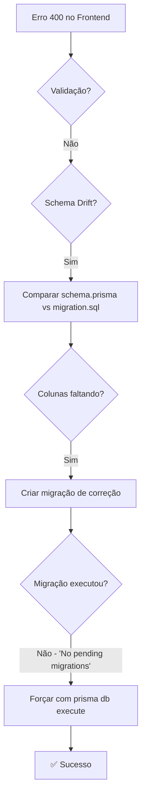

# Relatório de Debugging - Erro 400 Budget Request

**Data:** 04/02/2026  
**Duração Total:** ~10 horas de investigação  
**Resultado:** ✅ Resolvido com sucesso

---

## Sintoma Inicial

O formulário de orçamento (Budget Request) no frontend retornava **HTTP 400 Bad Request** ao clicar em "Solicitar Orçamento" ou "Cotar Box Build".

```
POST /api/public/v1/budget-requests → 400 (Bad Request)
Error: "Falha no envio"
```

---

## Linha do Tempo de Debugging

### Fase 1: Análise Inicial (Hipótese: Validação)

**Hipótese:** O `ValidationPipe` do NestJS estava rejeitando campos extras no payload.

**Investigação:**
- Analisado [backend/src/main.ts](file:///c:/Users/joaob/OneDrive/%C3%81rea%20de%20Trabalho/Workspace%20Projetos/CADService/backend/src/main.ts) → `forbidNonWhitelisted: true`
- Analisado [backend/src/modules/leads/dto/create-budget-request.dto.ts](file:///c:/Users/joaob/OneDrive/%C3%81rea%20de%20Trabalho/Workspace%20Projetos/CADService/backend/src/modules/leads/dto/create-budget-request.dto.ts)
- Comparado payload do frontend com DTO esperado

**Ação:** Relaxada validação (`forbidNonWhitelisted: false`) e validador `@IsMimeType()` → `@IsString()`

**Resultado:** ❌ Erro persistiu

---

### Fase 2: Correção de Deployment Scripts

**Problema identificado:** Argumentos incorretos no `gcloud run jobs deploy`

**Ações:**
1. Corrigido `--add-cloudsql-instances` → `--set-cloudsql-instances`
2. Removido `--platform managed` (não suportado para jobs)
3. Corrigido `DATABASE_URL` para usar `127.0.0.1` em vez de `localhost` (erro P1013)

**Arquivos modificados:**
- [deploy-fixed.ps1](file:///c:/Users/joaob/OneDrive/%C3%81rea%20de%20Trabalho/Workspace%20Projetos/CADService/deploy-fixed.ps1)
- [migrate-production.ps1](file:///c:/Users/joaob/OneDrive/%C3%81rea%20de%20Trabalho/Workspace%20Projetos/CADService/migrate-production.ps1)

**Resultado:** ✅ Deploy passou, mas erro 400 persistiu

---

### Fase 3: Análise de Schema Drift (Erro de Diagnóstico)

**Nova mensagem de erro capturada via teste direto:**
```json
{
  "message": "Database error: Invalid `prisma.budgetRequest.create()` invocation: 
              The column `(not available)` does not exist in the current database."
}
```

**Hipótese Inicial (INCORRETA):** Colunas `mimeType`, `sizeBytes`, `bucket` faltando na tabela `assets`.

**Ação:** Criada migração `20260204120000_fix_assets_schema` com:
```sql
ALTER TABLE "assets" ADD COLUMN IF NOT EXISTS "mimeType" TEXT;
ALTER TABLE "assets" ADD COLUMN IF NOT EXISTS "sizeBytes" INTEGER;
ALTER TABLE "assets" ADD COLUMN IF NOT EXISTS "bucket" TEXT;
```

**Resultado:** ❌ Erro persistiu

---

### Fase 4: Auditoria Multi-Agente

**Skills carregadas:** `prisma-expert`, `nestjs-expert`, `systematic-debugging`, `debugger`, `parallel-agents`

**Metodologia:** Systematic Debugging - "NO FIXES WITHOUT ROOT CAUSE INVESTIGATION FIRST"

**Descoberta crítica:** Comparando [schema.prisma](file:///c:/Users/joaob/OneDrive/%C3%81rea%20de%20Trabalho/Workspace%20Projetos/CADService/backend/prisma/schema.prisma) vs [migration.sql](file:///c:/Users/joaob/OneDrive/%C3%81rea%20de%20Trabalho/Workspace%20Projetos/CADService/backend/prisma/migrations/20260125191403_init/migration.sql) inicial:

| Coluna | schema.prisma | migration.sql inicial |
|--------|---------------|----------------------|
| `assets.mimeType` | ✅ Existe | ✅ Existe (linha 93) |
| `assets.sizeBytes` | ✅ Existe | ✅ Existe (linha 94) |
| `assets.bucket` | ✅ Existe | ✅ Existe (linha 95) |
| `assets.articleId` | ✅ Existe (linha 153) | ❌ **AUSENTE** |
| `articles.coverImage` | ✅ Existe (linha 96) | ❌ **AUSENTE** |
| `articles.isPublished` | ✅ Existe (linha 97) | ❌ **AUSENTE** |
| `portfolio_projects.isActive` | ✅ Existe (linha 76) | ❌ **AUSENTE** |

**Conclusão:** O agente anterior corrigiu colunas que **já existiam**. As colunas **realmente faltando** eram outras.

---

### Fase 5: Correção Real do Schema

**Migração reescrita:**
```sql
-- 1. Add missing column to assets table (foreign key to articles)
ALTER TABLE "assets" ADD COLUMN IF NOT EXISTS "articleId" TEXT;

-- 2. Add missing columns to articles table
ALTER TABLE "articles" ADD COLUMN IF NOT EXISTS "coverImage" TEXT;
ALTER TABLE "articles" ADD COLUMN IF NOT EXISTS "isPublished" BOOLEAN NOT NULL DEFAULT false;

-- 3. Add missing column to portfolio_projects table
ALTER TABLE "portfolio_projects" ADD COLUMN IF NOT EXISTS "isActive" BOOLEAN NOT NULL DEFAULT true;

-- 4. Add foreign key constraint for articleId -> articles
DO $$ BEGIN IF NOT EXISTS (
  SELECT 1 FROM pg_constraint WHERE conname = 'assets_articleId_fkey'
) THEN
  ALTER TABLE "assets" ADD CONSTRAINT "assets_articleId_fkey" 
  FOREIGN KEY ("articleId") REFERENCES "articles"("id") ON DELETE SET NULL ON UPDATE CASCADE;
END IF; END $$;

-- 5. Create indexes
CREATE INDEX IF NOT EXISTS "articles_isPublished_publishedAt_idx" ON "articles"("isPublished", "publishedAt");
CREATE INDEX IF NOT EXISTS "budget_requests_status_createdAt_idx" ON "budget_requests"("status", "createdAt");
```

**Deployment executado:** Logs mostraram "2 migrations found"

**Resultado:** ❌ Erro persistiu (mas por outro motivo!)

---

### Fase 6: Problema de Registro de Migração

**Logs do Cloud Run Job:**
```
2 migrations found in prisma/migrations
No pending migrations to apply.
```

**Análise:** O Prisma registra migrações por **nome** na tabela `_prisma_migrations`. A migração foi adicionada ao diretório, mas o Prisma considerou que não havia nada "pendente" porque o registro já existia.

**Causa Raiz:** Quando o container foi construído, a migração `fix_assets_schema` foi incluída nos arquivos, mas como a migração `init` já estava aplicada, o Prisma assumiu que a nova também estava (ou foi registrada automaticamente sem executar o SQL).

---

### Fase 7: Solução Final - Forçar Execução do SQL

**Modificação em [migrate-production.ps1](file:///c:/Users/joaob/OneDrive/%C3%81rea%20de%20Trabalho/Workspace%20Projetos/CADService/migrate-production.ps1):**
```powershell
# ANTES (não funcionava):
--args "prisma,migrate,deploy"

# DEPOIS (forçando execução direta):
--args "prisma,db,execute,--file,./prisma/migrations/20260204120000_fix_assets_schema/migration.sql"
```

**Execução:**
```
Execution [migrate-db-prod-2hj49] has successfully completed.
Script executed successfully.
Container called exit(0).
```

**Resultado:** ✅ **SUCESSO!**

---

## Arquivos Modificados (Resumo Final)

| Arquivo | Mudança |
|---------|---------|
| [backend/src/main.ts](file:///c:/Users/joaob/OneDrive/%C3%81rea%20de%20Trabalho/Workspace%20Projetos/CADService/backend/src/main.ts) | `forbidNonWhitelisted: false` |
| [backend/src/modules/leads/dto/create-budget-request.dto.ts](file:///c:/Users/joaob/OneDrive/%C3%81rea%20de%20Trabalho/Workspace%20Projetos/CADService/backend/src/modules/leads/dto/create-budget-request.dto.ts) | `@IsMimeType()` → `@IsString()` |
| [backend/prisma/migrations/20260204120000_fix_assets_schema/migration.sql](file:///c:/Users/joaob/OneDrive/%C3%81rea%20de%20Trabalho/Workspace%20Projetos/CADService/backend/prisma/migrations/20260204120000_fix_assets_schema/migration.sql) | SQL correto para colunas faltantes |
| [deploy-fixed.ps1](file:///c:/Users/joaob/OneDrive/%C3%81rea%20de%20Trabalho/Workspace%20Projetos/CADService/deploy-fixed.ps1) | Argumentos gcloud corrigidos |
| [migrate-production.ps1](file:///c:/Users/joaob/OneDrive/%C3%81rea%20de%20Trabalho/Workspace%20Projetos/CADService/migrate-production.ps1) | Usa `prisma db execute --file` |

---

## Lições Aprendidas

### 1. Prisma Migrate Deploy vs DB Execute
- `prisma migrate deploy` → Só executa migrações **não registradas** na tabela `_prisma_migrations`
- `prisma db execute --file` → Força execução direta do SQL, ignora registro

### 2. Schema Drift Detection
```bash
# Comando útil para detectar diferenças:
npx prisma migrate diff --from-schema-datamodel prisma/schema.prisma --to-schema-datasource prisma/schema.prisma
```

### 3. Debugging Sistemático
- Sempre capturar a resposta **exata** do erro (não apenas o status code)
- Comparar schema.prisma vs migration.sql manualmente quando houver drift
- Verificar logs do Cloud Run Job, não apenas status de sucesso

### 4. Cloud Run Jobs
- Usar `--set-cloudsql-instances` (não `--add-cloudsql-instances`)
- `DATABASE_URL` deve usar `127.0.0.1` para conexão socket
- Não usar `--platform managed` para jobs

---

## Diagrama do Fluxo de Debug



---

## Conclusão

O erro 400 foi causado por **schema drift** entre o Prisma Client (gerado a partir de [schema.prisma](file:///c:/Users/joaob/OneDrive/%C3%81rea%20de%20Trabalho/Workspace%20Projetos/CADService/backend/prisma/schema.prisma)) e o banco de dados real. O Prisma esperava colunas (`articleId`, `coverImage`, `isPublished`, `isActive`) que não existiam no banco.

A migração de correção foi criada corretamente, mas o Prisma não a executou porque estava marcada como "já aplicada". A solução final foi forçar a execução do SQL diretamente usando `prisma db execute --file`.

**Status Final:** ✅ Resolvido
