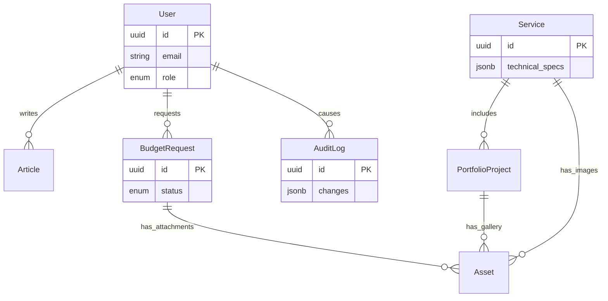

# CADService Data Model & Architecture

## Context

Platform for CADService Products Electronics, hosted on GCP with NestJS + PostgreSQL.

## Core Entities

### 1. User

Central identity for admins and future clients.

- **id**: UUID (PK)
- **email**: Unique, Indexed
- **role**: Enum (ADMIN, CLIENT)
- **is_active**: Boolean (Control access)

### 2. Service

The industrial services offered (e.g., "PCB Design", "Industrial Automation").

- **technical_specs**: JSONB. Key decision for flexibility. Allows different technical fields for different service types without schema migration.

### 3. PortfolioProject

Case studies linked to Services.

- **images**: Manage via `Asset` entity.

### 4. BudgetRequest (Orçamento)

Critical for business conversion.

- **status**: State machine (PENDING -> REVIEWED -> QUOTED).
- **attachments**: Linked via `Asset`.

### 5. Asset

Unified media management.

- **Justification**: Decouples storage logic from business logic. Supports GCS (Google Cloud Storage).

### 6. AuditLog

Traceability for industrial standards (ISO).

- **changes**: JSONB (Stores before/after state).
- **action**: CREATE, UPDATE, DELETE.

## Relationships Diagram (Mermaid)

## Technical Decisions Justification

1.  **UUIDv7**: Used for Primary Keys. Better than standard V4 for database indexing (time-sortable) while being secure and distributed-friendly for GCP.
2.  **JSONB**: Used for `technical_specs`. Industrial products have highly variable attributes. Relational tables for attributes would be over-engineering.
3.  **AuditLog**: Necessary for "Rastreabilidade e histórico" requirement.
